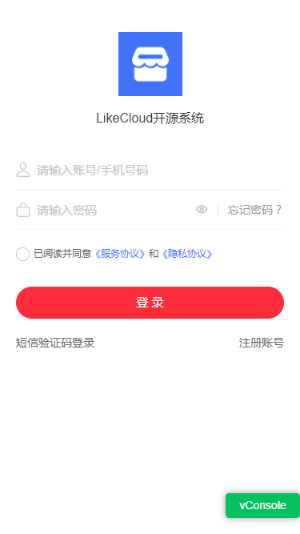
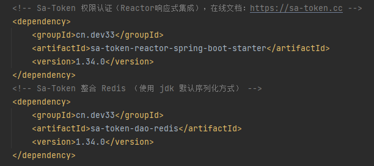
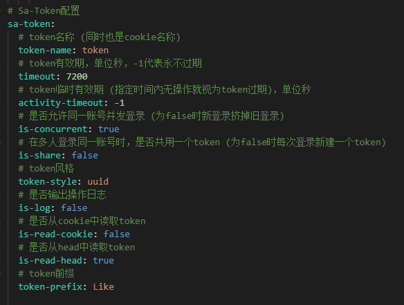
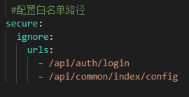
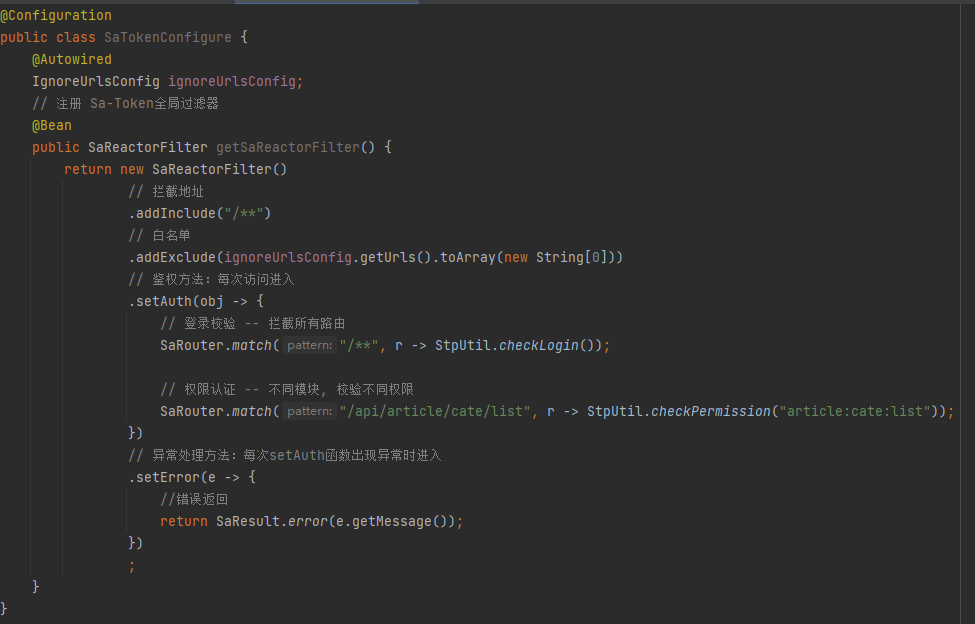
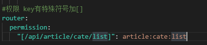
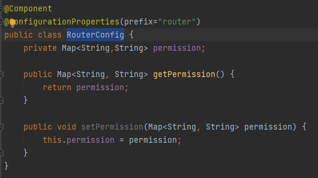
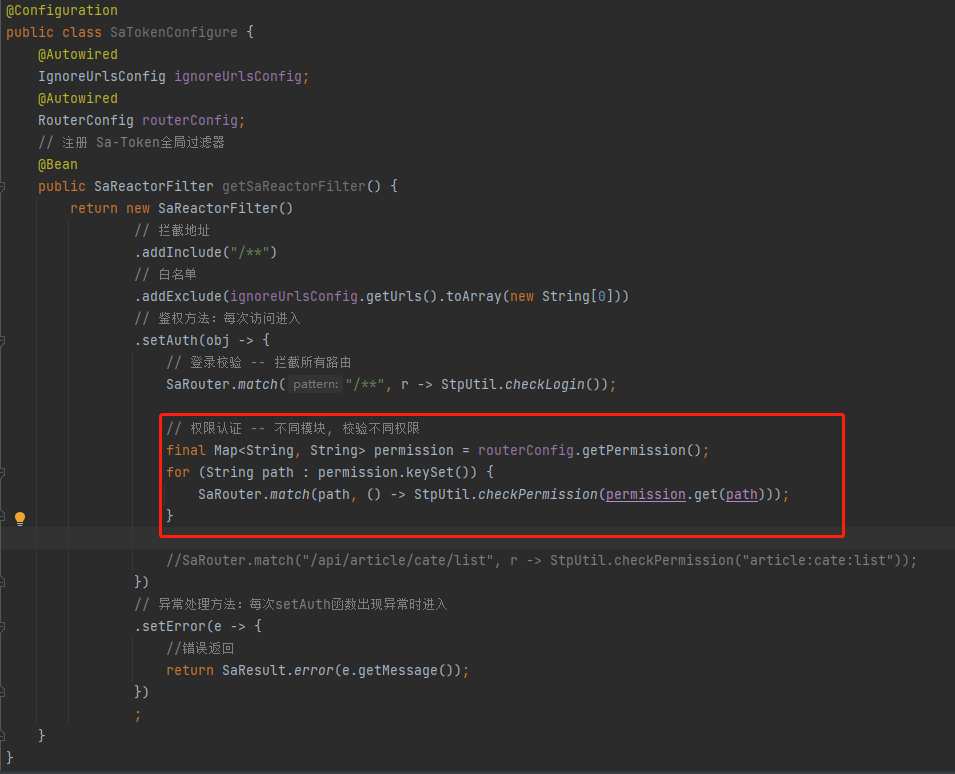

# like-cloud
<p>
<a href="https://github.com/claire0821/like-cloud"></a>
<a href="https://github.com/claire0821/like-cloud-web"></a>
<a href="https://github.com/claire0821/like-cloud-web"></a>
</p>

## 项目介绍

`like-cloud`是一套微服务商城系统，采用了 Spring Cloud 2021 & Alibaba、Spring Boot 2.7、Oauth2、MyBatis、Elasticsearch、Docker、Kubernetes等核心技术，同时提供了基于Vue的管理后台方便快速搭建系统。`like-cloud`在电商业务的基础集成了注册中心、配置中心、监控中心、网关等系统功能。

## 组织结构
``` lua
like-cloud
├── mall-admin -- 
├── mall-auth -- 认证中心
├── mall-cart -- 购物车模块
├── mall-common -- 工具类及通用代码模块
├── mall-coupon -- 优惠营销服务
├── mall-gateway -- 网关服务
├── mall-generator -- 代码生成器模块
├── mall-member -- 会员服务
├── mall-order -- 订单服务
├── mall-product -- 商品信息服务
├── mall-search -- 基于Elasticsearch的商品搜索系统服务
├── mall-seckill -- 秒杀服务
├── mall-ware -- 库存服务
└── docs  -- 配置中心存储的配置
    ├── nacos  -- Nacos配置
    ├── sql  -- SQL脚本
```

## 技术选型

### 后端技术

| 技术                   | 说明                 | 官网                                                 |
| ---------------------- | -------------------- | ---------------------------------------------------- |
| Spring Cloud           | 微服务框架           | https://spring.io/projects/spring-cloud              |
| Spring Cloud Alibaba   | 微服务框架           | https://github.com/alibaba/spring-cloud-alibaba      |
| Spring Boot            | 容器+MVC框架         | https://spring.io/projects/spring-boot               |
| Spring Security Oauth2 | 认证和授权框架       | https://spring.io/projects/spring-security-oauth     |
| MyBatis                | ORM框架              | http://www.mybatis.org/mybatis-3/zh/index.html       | |
| PageHelper             | MyBatis物理分页插件  | http://git.oschina.net/free/Mybatis_PageHelper       |
| Knife4j                | 文档生产工具         | https://github.com/xiaoymin/swagger-bootstrap-ui     |
| Elasticsearch          | 搜索引擎             | https://github.com/elastic/elasticsearch             |
| RabbitMq               | 消息队列             | https://www.rabbitmq.com/                            |
| Redis                  | 分布式缓存           | https://redis.io/                                    | |
| Docker                 | 应用容器引擎         | https://www.docker.com/                              |
| Druid                  | 数据库连接池         | https://github.com/alibaba/druid                     |
| OSS                    | 对象存储             | https://github.com/aliyun/aliyun-oss-java-sdk        |
| MinIO                  | 对象存储             | https://github.com/minio/minio                       |
| JWT                    | JWT登录支持          | https://github.com/jwtk/jjwt                         |
| LogStash               | 日志收集             | https://github.com/logstash/logstash-logback-encoder |
| Lombok                 | 简化对象封装工具     | https://github.com/rzwitserloot/lombok               |
| Seata                  | 全局事务管理框架     | https://github.com/seata/seata                       |
| Portainer              | 可视化Docker容器管理 | https://github.com/portainer/portainer               |
| Jenkins                | 自动化部署工具       | https://github.com/jenkinsci/jenkins                 |
| Kubernetes             | 应用容器管理平台     | https://kubernetes.io/                               |

### 前端技术

| 技术       | 说明                  | 官网                           |
| ---------- | --------------------- | ------------------------------ |
| Vue        | 前端框架              | https://vuejs.org/             |
| Vue-router | 路由框架              | https://router.vuejs.org/      |
| Vuex       | 全局状态管理框架      | https://vuex.vuejs.org/        |
| Element    | 前端UI框架            | https://element.eleme.io/      |
| Axios      | 前端HTTP框架          | https://github.com/axios/axios |
| v-charts   | 基于Echarts的图表框架 | https://v-charts.js.org/       |


## 环境搭建

### 开发环境

| 工具          | 版本号 | 下载                                                         |
| ------------- | ------ | ------------------------------------------------------------ |
| JDK           | 1.8    | https://www.oracle.com/technetwork/java/javase/downloads/jdk8-downloads-2133151.html |
| Mysql         | 8.0.20 | https://www.mysql.com/                                       |
| Redis         | 3.2.100| https://redis.io/download                                    |
| Elasticsearch | 7.17.3 | https://www.elastic.co/cn/downloads/elasticsearch            |
| Kibana        | 7.17.3 | https://www.elastic.co/cn/downloads/kibana                   |
| Logstash      | 7.17.3 | https://www.elastic.co/cn/downloads/logstash                 |
| RabbitMq      | 3.11.4 | http://www.rabbitmq.com/download.html                        |
| nginx         | 1.22   | http://nginx.org/en/download.html                            |

### 搭建步骤

> Windows环境部署


> Docker环境部署


> Kubernetes环境部署


## 运行效果展示
部分已完成页面展示
### 管理平台

### uniapp



## 文档
### 集成Sa-Token
官网：https://sa-token.cc/
#### 在SpringCloud中使用Sa-Token
使用网关统一鉴权，网关负责登录校验和权限校验
##### 配置网关服务
官网文档：https://sa-token.cc/doc.html#/start/webflux-example
https://sa-token.cc/doc.html#/micro/gateway-auth
###### pom.xml 
底层是WebFlux实现，是基于Reactor模型编程的，所以引入sa-token-reactor-spring-boot-starter
参考文档
- [引入Spring WebFlux 集成 Sa-Token 示例](https://sa-token.cc/doc.html#/start/webflux-example?id=spring-webflux-%e9%9b%86%e6%88%90-sa-token-%e7%a4%ba%e4%be%8b)

###### nacos配置sa-token和网关白名单


###### 创建全局过滤器


###### auth认证中心处理登录并返回token

###### 网关权限认证
将路由拦截鉴权动态化，把鉴权规则放在配置文档



参考文档
- [路由拦截鉴权](https://sa-token.cc/doc.html#/use/route-check)
- [Sa-Token 集成 Redis](https://sa-token.cc/doc.html#/up/integ-redis)
- [参考：把路由拦截鉴权动态化](https://sa-token.cc/doc.html#/fun/dynamic-router-check)
- [参考：将权限数据放在缓存里](https://sa-token.cc/doc.html#/fun/jur-cache)